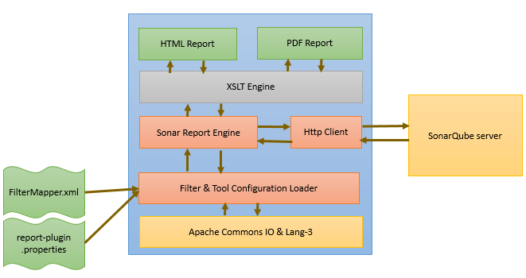

## Sonar Plugins
Sonar Plugins help to download sonar scanning reports in the form of HTML / PDF which we can share with audience.

### Overview:
Sonar Report Plugin help to download sonar scanning reports with the help of filters such as,- Types, Resolutions, 
Severities, Projects and DateRange. We can give sonarqube server url in *report-plugin.properties* file. With the 
help of filters and sonarqube server configuration tool fetch JSON response from server. Once tool receive JSON 
response from server it convert json response to XML format and apply XSLT to generate HTML / PDF report.

### Project Layers:

| Layers | Available | Technology |
| ------ | ------ | ------ |
| Client side layer | No | Not Applicable |
| Cascade style layer | Yes | XSLT |
| Server Web layer | No | Not Applicable |
| Service layer | Yes | Core Java |
| Database layer | No | Not Applicable |

### Technology Stack :

| Technology | Version |
| ------- | ------- |
| Core Java | Adopt Open JDK (11.0.7) |
| Maven | Apache Maven 3.5.0 |
| XSLT | 2.0 |

### Benifits:

- Reporting
  - Download sonar scanning reports in the form of HTML / PDF which we can share with audience
  - Keep track of sonar scanning issue as we have list of all open / resolved / closed issue.

### Architecture Overview:

  

### Tool configuration:
 - Edit **_report-plugin.properties**_ file
  ```markdown
#sonar qube server URL.
sonar.qube.server.url=http://SONAR_QUBE_SERVER_HOSTNAME:PORT/
#report xml stylesheet template.
report.xslt.template=../conf/Report.xsl
#report output file name.
report.output.file=../conf/OutputXMLReport.html
#supported formats - html, xml, pdf
report.output.format=html
 ```
 - Edit **_FilterMapper.xml**_ file
 ```markdown
<?xml version="1.0" encoding="UTF-8"?>
<!-- This Filter used to fetch requirement specific data from SonarQube server. -->
<Filter>
  <!-- Types node value contains comma separated issue type. 
       BUG indicate sonar reported bug. 
       VULNERABILITY indicate sonar reported vulnerabilities. 
       If we keep Types node value is blank then it will show all types of sonar reported issue.
  -->
	<Types>BUG,VULNERABILITY</Types>
  <!-- Resolutions node value contains comma separated resolutions of sonar reported issue. 
       OPEN indicates sonar reported issue whose implementation status is currently Open. 
       FALSE-POSITIVE indicates sonar reported issue's implementation status is currently marked as false positive by developer. 
       WONTFIX indicates sonar reported issue is as per designed and we can't able to fix this.
       FIXED indicates sonar reported issue is Fixed.
       CLOSED indicates sonar reported issue is Fixed and after sonar scann it gets validated and marked as Closed. 
       If we keep Resolutions node value is blank then it will show all resolutions sonar reported issue.
  -->
	<Resolutions>FALSE-POSITIVE,WONTFIX,FIXED,REMOVED</Resolutions>
	<Severities>BLOCKER</Severities>
	<Projects></Projects>
	<DateRange>
		<CreatedAfter>2019-02-03</CreatedAfter>
		<CreatedBefore>2019-02-15</CreatedBefore>
	</DateRange>
</Filter>

```
 - Edit **_Report.xsl**_ file
 ```markdown
dfdg
```

### Important Links:

| Description | Link |
| -------- | -------- |
| Source Code | <span style="color: green;font-weight: bold;"><a href="https://github.com/ravaan-techky/sonar-plugins/archive/master.zip"><i class="fa fa-download"></i></a></span> |
| Circle CI <If Available> | Not Available |
| Documentation | <span style="color: green;font-weight: bold;"><a href="https://ravaan-techky.github.io/sonar-plugins/index"><i class="fa fa-folder-open"></i></a></span> |
  
### Developer Information:

| Description | Github Profile Link  | LinkedIn Profile Link | Email Address
| -------- | -------- | -------- | -------- |
| Vaishali Patil | [<i class="fa fa-external-link"></i>](https://github.com/ravaan-techky/) | [<i class="fa fa-external-link"></i>](#) | [ravaan.techky@gmail.com](mailto:ravaan.techky@gmail.com) |

<br/><br/>
[<i class="fa fa-arrow-left"></i> **Back**](/documentation/)
